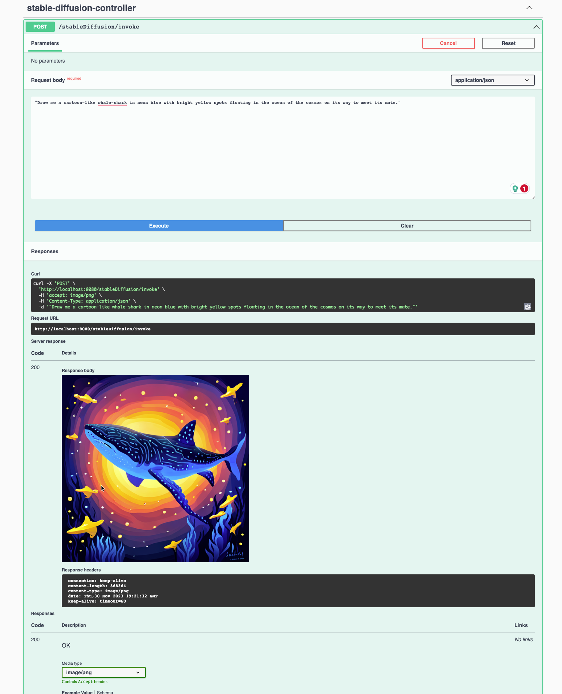

# Demo for Spring Cloud AWS Bedrock Starter 

This is a Companion Demo Project that leverages [Spring Cloud AWS Bedrock Starter](https://github.com/clue2solve/spring-cloud-aws-bedrock-starter). 

## Prerequisites

Make use of an existing or sign up for a new, AWS account. You will need credentials with appropriate IAM role and permissions. (We've tested this with an IAM user with a role that has a PowerUserAccess AWS managed policy attached).

Download and install the following CLIs

* [gh](https://github.com/cli/cli#installation) 2.39.2 or better
* [git](https://git-scm.com/book/en/v2/Getting-Started-Installing-Git) 2.39.3 or better
* [sdkman](https://sdkman.io/install) 5.18.2 or better
* [http](https://httpie.io/docs/cli/installation)

Download and install a JDK and Maven

```bash
sdk install java 21.0.1-librca
sdk install maven 3.9.5
```
> Accept these as the default versions

Include the right Maven dependency into your project
```xml
<dependency>
    <groupId>io.clue2solve</groupId>
    <artifactId>spring-cloud-aws-bedrock-starter</artifactId>
    <version>0.0.2-SNAPSHOT</version>
</dependency>
```

or build the Starter from sources and install it into your local Maven repository


## Clone

```bash
gh repo clone https://github.com/pacphi/spring-cloud-aws-bedrock-starter
gh repo clone https://github.com/pacphi/BedrockSpringBootStarterDemo
```


## Build

```bash
cd spring-cloud-aws-bedrock-starter
mvn clean install
cd ../BedrockSpringBootStarterDemo
mvn clean install
```

## Set environment variables

```bash
export AWS_ACCESS_KEY_ID=
export AWS_SECRET_ACCESS_KEY=
```
> Make certain you are using authorized AWS credentials


## Setup Bedrock

Review [Set up Amazon Bedrock](https://docs.aws.amazon.com/bedrock/latest/userguide/setting-up.html) instructions.


## Launch application

```bash
mvn spring-boot:run
```
> Press Ctrl+C to quit


## Interact with service endpoints

### Claude

```bash
❯ http POST :8080/claude/invoke data="How much on average does an African lion weigh in pounds"
HTTP/1.1 200
Connection: keep-alive
Content-Length: 440
Content-Type: application/json
Date: Thu, 30 Nov 2023 14:26:55 GMT
Keep-Alive: timeout=60

 Here are some key details about the average weight of African lions:

- Male African lions typically weigh 330 to 550 pounds (150 to 250 kg).

- Female African lions typically weigh 265 to 395 pounds (120 to 180 kg).

- On average, male African lions are larger and heavier than females. 

- The average weight for an adult male African lion is about 420 pounds (190 kg).

- The average weight for an adult female African lion is about 280
```

### Jurassic

```bash
❯ http POST :8080/jurassic/invoke
```

### Llama

```bash
❯ http POST :8080/llama/invoke
```

### Titan

```bash
❯ http POST :8080/titan/invoke
```

### StableDiffusion

```bash
❯ http POST :8080/stablediffusion/invoke
```

Or with the [hoppscotch](https://docs.hoppscotch.io/documentation/clients/desktop) desktop application:


